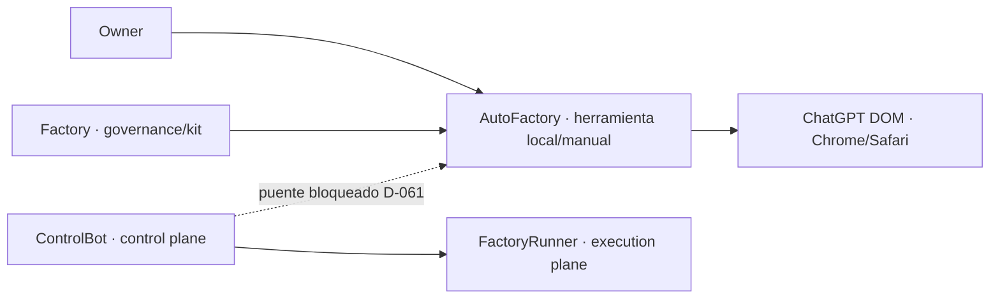
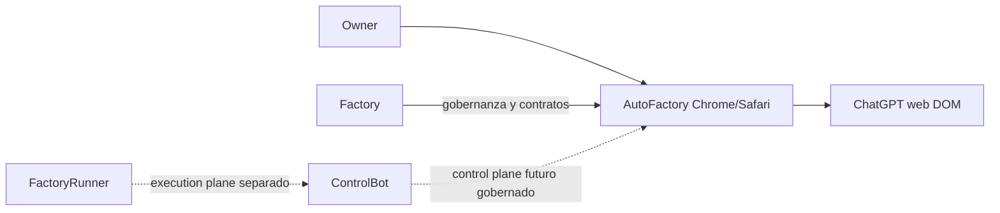

# ChatGPT Autopilot Local — Chrome y Safari

> Herramienta local/manual del dueño para mantener flujos de ChatGPT activos de forma controlada. No es un servidor web ni el execution plane de la fábrica.

**Rol en la fábrica:** local/manual tool · **Fase:** construction · **Roadmap:** GitHub Issues + [AutoFactory #1](https://github.com/pl0n3r/AutoFactory/issues/1)

AutoFactory supervisa chats habilitados usando el DOM real de ChatGPT. No usa capturas, coordenadas, posición de ventanas ni `pyautogui`; no pulsa aprobaciones, permisos, compras, selectores de modelo ni acciones destructivas. Chrome y Safari comparten el mismo núcleo y el puente con ControlBot permanece sin tráfico real hasta satisfacer D-061 y sus puertas legales/seguridad.

## Operational Cockpit

<!-- factory:status:start -->
| Señal | Estado |
| --- | --- |
| main SHA | UNKNOWN |
| versión | UNKNOWN |
| CI | UNKNOWN |
| release | UNKNOWN |
| health | UNKNOWN |
| smoke/observer | UNKNOWN |
| quality/security | UNKNOWN |
| Issue activo | UNKNOWN |
| PR activo | UNKNOWN |
| último release | UNKNOWN |
<!-- factory:status:end -->

### Progress + Readiness

<!-- factory:progress-readiness:start -->
| Señal | Estado |
| --- | --- |
| Target | UNKNOWN |
| Progress | UNKNOWN |
| Readiness | UNKNOWN |
| Evidence freshness | UNKNOWN |
| Critical blockers | UNKNOWN |
| Trend | UNKNOWN |

| Dimensión | Progress | Readiness |
| --- | --- | --- |
| UNKNOWN | UNKNOWN | UNKNOWN |
<!-- factory:progress-readiness:end -->

> UNKNOWN/PENDING indica ausencia de evidencia canónica suficiente; nunca equivale a GREEN. En AutoFactory, CI verde no acredita por sí solo una extensión instalable ni un smoke Chrome/Safari.

## Work Queue

- **NOW:** [#58 — adoptar README Contract v1](https://github.com/pl0n3r/AutoFactory/issues/58).
- **NEXT:** mantener [#1 — puente con Factory Control](https://github.com/pl0n3r/AutoFactory/issues/1) bloqueado hasta resolver runtime real, consentimiento, seguridad y D-061.
- **LATER:** ampliar automatización local únicamente mediante Issues gobernados y sin eludir límites o controles de plataforma.
- **BLOCKED:** pairing/tráfico real con ControlBot, endpoints reales y tratamientos personales permanecen bloqueados por D-061 y la puerta legal asociada.

Esta cola es un resumen operativo. Los Issues y `decisiones.yml` siguen siendo la planificación y decisiones canónicas; el README no reemplaza changelog ni roadmap.

## Qué hace el producto

AutoFactory mantiene trabajando pestañas de ChatGPT habilitadas:

- espera mientras ChatGPT responde y continúa cuando la respuesta termina;
- usa el compositor y botón reales del DOM, con validación del texto antes de enviar;
- recupera errores mediante **Reintentar** o **Continuar generando** cuando la interfaz lo permite;
- puede gestionar varias pestañas habilitadas con heartbeat local;
- conserva diagnóstico minimizado sin texto de conversaciones, tokens ni IDs de chat identificables;
- mantiene Chrome y Safari sobre el mismo núcleo web.

No autoriza compras, MFA, permisos, CAPTCHA, acciones destructivas ni cambios de cuenta. AutoFactory no decide prioridades de la fábrica y no sustituye a ControlBot ni FactoryRunner.

## Arquitectura en 60 segundos



- **Factory** aporta gobernanza, contratos y workflows reutilizables.
- **ControlBot** es el control plane y mantiene estado/dirección durable.
- **FactoryRunner** es el execution plane para órdenes ya gobernadas.
- **AutoFactory** permanece separado como herramienta local/manual operada por el dueño.

## Stack e infraestructura

- **Producto:** extensión Chrome + contenedor Safari/Xcode.
- **Runtime web:** JavaScript / Node.js >=20 para pruebas.
- **Chrome:** Manifest V3, service worker y content scripts.
- **Safari:** proyecto nativo generado/sincronizado desde las mismas fuentes web.
- **Persistencia:** almacenamiento local del navegador para configuración/diagnóstico minimizado.
- **Release:** GitHub Releases mediante el kit Factory; no ZIPs ad hoc.
- **Servidor/DB:** no presupuestos por defecto; AutoFactory no es una aplicación Hostinger ni requiere base de datos.

La versión instalable debe mantener paridad entre `manifest.json`, `package.json`, `package-lock.json` y el manifiesto Safari cuando aplique un corte.

## Ciclo de entrega

Issue → estado/reserva → `trabajo/issue-N` → PR → tests/Factory gates → revisión → merge serial → release oficial → smoke de instalación/carga Chrome/Safari.

Cuando el bot de coordinación no esté instalado, `AGENTES.md` permite fallback local: comentario de plan + `estado: reservado` sin inventar UUID. Una vez instalada coordinación Factory, se usa el flujo canónico.

Un merge o CI verde no equivale a producción VERDE de AutoFactory. La entrega instalable exige evidencia de release y smoke de la extensión.

## Calidad y seguridad

- No registrar texto de chats, tokens, correos ni IDs identificables de conversación.
- No automatizar aprobaciones, permisos, compras, CAPTCHA, MFA ni acciones destructivas.
- No eludir rate limits ni controles de plataforma.
- Toda modificación de tratamientos personales exige actualizar `datos.yml` y aplicar puertas legales.
- Mantener release anterior instalable como rollback.
- Preservar paridad Chrome/Safari.
- El puente con ControlBot permanece sin tráfico real, pairing o tratamientos reales hasta D-061.

## Roadmap y fuentes de verdad

- Gobierno común: [pl0n3r/Factory](https://github.com/pl0n3r/Factory) y `PLAN-AGENTES.md`.
- Trabajo propio: [AutoFactory Issues](https://github.com/pl0n3r/AutoFactory/issues).
- Puente ControlBot: [AutoFactory #1](https://github.com/pl0n3r/AutoFactory/issues/1).
- Decisiones vigentes: `decisiones.yml`.
- Tratamiento de datos: `datos.yml`.
- Contrato operativo: `AGENTES.md`.
- Historial: [CHANGELOG.md](CHANGELOG.md).
- Documentación profunda: `docs/`.

Estas fuentes mandan sobre snapshots históricos del README.

## Desarrollo local

Requisitos: Node.js >=20. Para Safari, macOS + Xcode.

```bash
npm ci --ignore-scripts --no-audit --no-fund
npm test
```

Para Safari:

```bash
./build-safari.sh
```

No se requieren credenciales reales para ejecutar la suite local.

## Mapa de la fábrica

- **Factory** — governance/kit y contratos comunes.
- **ControlBot** — control plane, priorización, elegibilidad y estado durable.
- **FactoryRunner** — execution plane; ejecuta órdenes ya gobernadas y reporta evidencia.
- **Condor / GrindFlow / BRVTAL** — productos construidos por la fábrica.
- **AutoFactory** — herramienta local/manual del dueño para continuidad de chats.

AutoFactory no se fusiona con FactoryRunner: pueden coexistir, pero sus autoridades, runtime y ciclo de entrega son distintos.

## Instalación y uso

### Instalar en Chrome

1. Abre `chrome://extensions`.
2. Activa **Modo de desarrollador**.
3. Pulsa **Cargar descomprimida**.
4. Selecciona la carpeta raíz que clonaste.
5. Recarga las pestañas de ChatGPT que ya estaban abiertas.

### Instalar en Safari

1. Clona el repositorio en macOS con Xcode instalado.
2. Ejecuta `./build-safari.sh` desde la raíz.
3. Abre `safari/ChatGPT Autopilot Local.xcodeproj`.
4. En Xcode, selecciona tu equipo de firma si macOS lo solicita y pulsa **Run**.
5. Abre Safari > Ajustes > Extensiones, activa **ChatGPT Autopilot Local**, permite acceso a `chatgpt.com` y recarga las pestañas abiertas.

Chrome y Safari comparten el mismo núcleo y selectores DOM. `build-safari.sh` sincroniza la fuente web con el contenedor nativo antes de compilar.

### Usar

Pulsa **ACTIVAR TODAS** una vez. Las pestañas habilitadas trabajan de forma independiente y **PAUSAR TODAS** detiene el piloto global.

La extensión escribe en `#prompt-textarea`, relee el mensaje exacto y solo pulsa el botón real `#composer-submit-button` / `data-testid="send-button"`. Si no encuentra esos elementos, no envía nada.

Antes de cada envío exige lecturas consecutivas e idénticas del campo. Si React/ChatGPT altera el texto durante ese intervalo, cancela el envío para evitar duplicados.

## Confiabilidad y memoria adaptativa local

AutoFactory conserva muestras locales de tiempos de inicio/respuesta, ciclos, recuperaciones y fallos para ajustar umbrales de detección de bloqueos. Esa memoria permanece en el navegador y no guarda el texto de las conversaciones.

Ante conexiones interrumpidas, espera recuperación antes de cancelar o recargar. Los envíos pendientes se conservan de forma que reduzca duplicados y se aplica backoff/circuit breaker cuando los fallos se repiten.

El seguimiento visual usa desplazamiento progresivo de contenedores relevantes y respeta pausas manuales. Las acciones automáticas permitidas se limitan a esperas, recarga controlada, **Reintentar** y **Continuar generando**; autenticación o autorización requieren intervención humana.

## Log de diagnóstico

El service worker conserva un historial local acotado de eventos técnicos. No guarda mensajes ni contenido del chat; las rutas se anonimizan por categoría y se excluyen identificadores de conversación. **COPIAR LOG** produce una salida sanitizada y **BORRAR LOG** elimina la copia local.

Consulta [CHANGELOG.md](CHANGELOG.md) para el detalle histórico de versiones y cambios.


---

### Project Card

> Autopiloto local para mantener flujos de trabajo de ChatGPT en Chrome y Safari bajo límites explícitos de seguridad.

**Rol en la fábrica:** herramienta local/manual · **Fase:** construction · **Roadmap:** [Issue #1](https://github.com/pl0n3r/AutoFactory/issues/1)

## Operational Cockpit

<!-- factory:status:start -->
| Señal | Estado |
| --- | --- |
| main SHA | UNKNOWN |
| versión | UNKNOWN |
| CI | UNKNOWN |
| release | UNKNOWN |
| health | UNKNOWN |
| smoke/observer | UNKNOWN |
| quality/security | UNKNOWN |
| Issue activo | UNKNOWN |
| PR activo | UNKNOWN |
| último release | UNKNOWN |
<!-- factory:status:end -->

### Progress + Readiness

<!-- factory:progress-readiness:start -->
| Señal | Estado |
| --- | --- |
| Target | UNKNOWN |
| Progress | UNKNOWN |
| Readiness | UNKNOWN |
| Evidence freshness | UNKNOWN |
| Critical blockers | UNKNOWN |
| Trend | UNKNOWN |

| Dimensión | Progress | Readiness |
| --- | --- | --- |
| UNKNOWN | UNKNOWN | UNKNOWN |
<!-- factory:progress-readiness:end -->

> Estos bloques son derivados. `UNKNOWN` / `PENDING` significan que falta evidencia canónica; nunca se sustituyen por `GREEN` sin evidencia verificable.

## Work Queue

- **NOW:** [#58 — adoptar README Contract v1](https://github.com/pl0n3r/AutoFactory/issues/58).
- **NEXT:** [#59 — detectar revisión de plataforma sin tratarla como sesión colgada](https://github.com/pl0n3r/AutoFactory/issues/59).
- **LATER:** [#1 — puente con Factory Control](https://github.com/pl0n3r/AutoFactory/issues/1).
- **BLOCKED:** el tráfico real con ControlBot permanece sujeto a D-061 y a la puerta legal/seguridad correspondiente; no se presume por merge.

Esta cola es un resumen enlazado. El roadmap y el estado real continúan en GitHub Issues.

## Qué hace el producto

AutoFactory es una extensión Chrome/Safari que supervisa localmente chats habilitados, espera respuestas, continúa flujos permitidos y aplica recuperación acotada. No decide prioridades de la fábrica, no concede permisos, no evita controles de plataforma y no sustituye a ControlBot ni a FactoryRunner.

## Arquitectura en 60 segundos



AutoFactory permanece como herramienta local/manual. Cualquier integración real con ControlBot debe atravesar contratos, consentimiento y controles de seguridad explícitos.

## Stack e infraestructura

- JavaScript/Node.js para la extensión y sus pruebas.
- Chrome Extension y contenedor nativo Swift/Xcode para Safari.
- Estado local del navegador, sin servidor web ni base de datos propia.
- GitHub Actions para CI y releases.
- Sin Hostinger, MariaDB ni runtime remoto implícitos.

## Ciclo de entrega

Issue → reserva → `trabajo/issue-N` → PR → Factory CI → revisión → merge → release versionada → smoke de instalación/carga Chrome/Safari → evidencia de entrega.

Un CI verde por sí solo no acredita la extensión como VERDE. La versión anterior instalable se conserva para reversión.

## Calidad y seguridad

- `npm test` es la regresión base.
- Los cambios instalables deben conservar paridad Chrome/Safari y smoke de instalación/carga.
- No se registran textos de conversaciones, tokens, correos ni IDs de chat identificables.
- Los cambios de tratamiento de datos exigen actualizar `datos.yml` y sus puertas legales.
- AutoFactory no automatiza aprobaciones, compras, autenticación, CAPTCHA/MFA ni bypass de rate limits.
- Los bloques operativos del README fallan cerrado ante ausencia de evidencia.

## Roadmap y fuentes de verdad

- Roadmap canónico: [Issue #1](https://github.com/pl0n3r/AutoFactory/issues/1) y sus hojas.
- Gobernanza: [Factory PLAN-AGENTES.md](https://github.com/pl0n3r/factory/blob/main/PLAN-AGENTES.md).
- Contrato local: `AGENTES.md`.
- Decisiones vigentes: `decisiones.yml`.
- Datos y privacidad: `datos.yml`.
- Historia de versiones: `CHANGELOG.md` y GitHub Releases.
- Documentación profunda: `docs/`.

El README enlaza estas fuentes; no reemplaza roadmap, changelog ni evidencia de CI/release.

## Desarrollo local

Comandos reales y reproducibles:

```bash
npm install
npm test
./build-safari.sh
```

Para Chrome, carga la raíz como extensión descomprimida. Para Safari, `build-safari.sh` sincroniza la fuente web antes de abrir el proyecto Xcode.

## Mapa de la fábrica

- **Factory:** governance/kit y contratos comunes.
- **ControlBot:** control plane privado.
- **FactoryRunner:** execution plane autónomo.
- **Condor / GrindFlow / BRVTAL:** productos.
- **AutoFactory:** **herramienta local/manual** para sesiones web autorizadas.

AutoFactory es el repositorio actual; su elegibilidad en el dispatcher no cambia estas responsabilidades.
